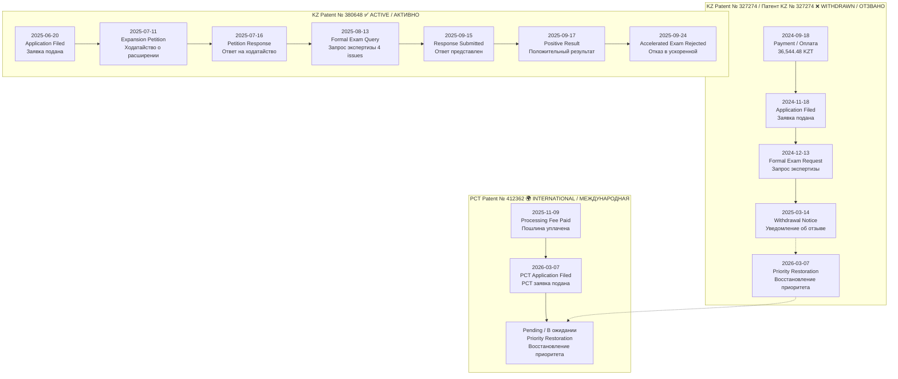
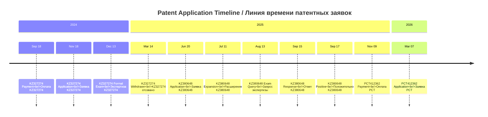
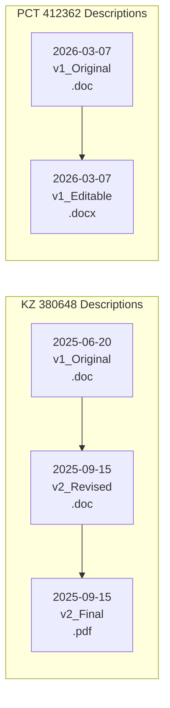
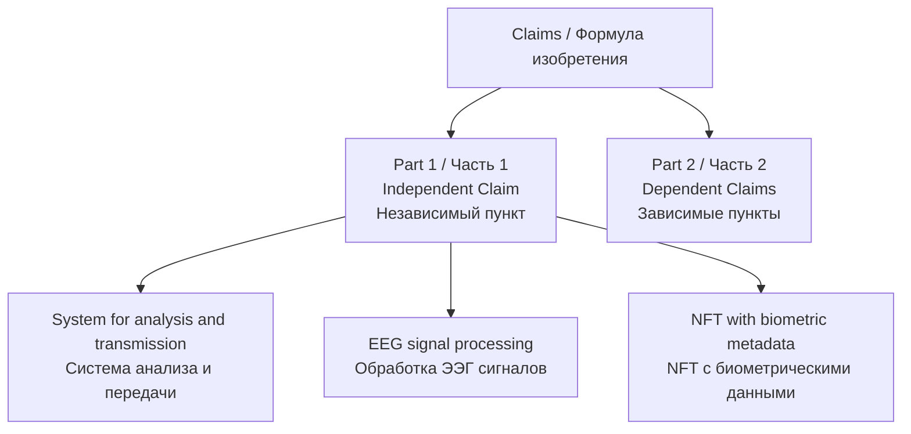
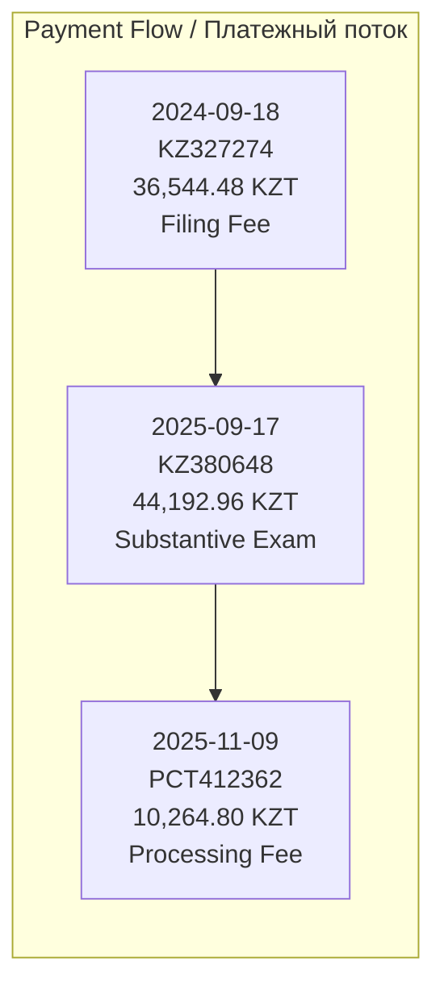
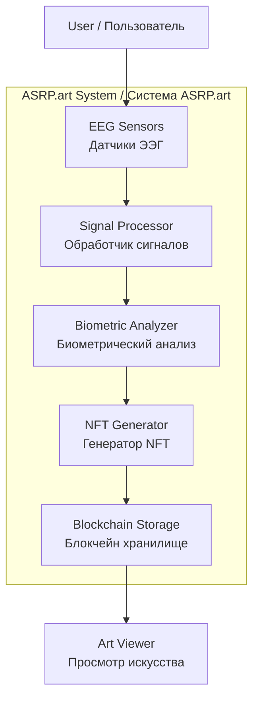
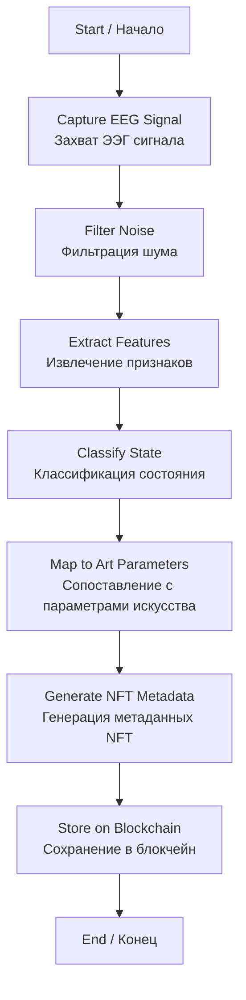
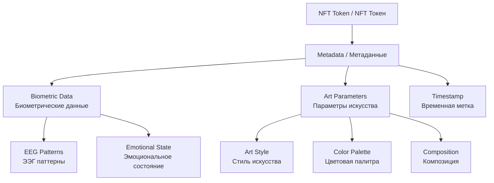

# 📎 ASRP.art Patent Documents Repository
# Репозиторий патентных документов ASRP.art

**Repository / Репозиторий:** Kazpatent_Axionetic_Sensing_Reactions_Platform_in_Art_Patent  
**Last Updated / Последнее обновление:** 23 March 2026  
**Total Files / Всего файлов:** 33 (unique official documents / уникальные официальные документы)  
**Naming Convention / Конвенция именования:** `YYYY-MM-DD_DocumentType_Application_Version_Description_Language.ext`

---

## 📋 TABLE OF CONTENTS / СОДЕРЖАНИЕ

1. [Document Flow Overview / Обзор документооборота](#document-flow-overview--обзор-документооборота)
2. [Applications Summary / Сводка по заявкам](#applications-summary--сводка-по-заявкам)
3. [Chronological Timeline / Хронологическая линия](#chronological-timeline--хронологическая-линия)
4. [Document Categories / Категории документов](#document-categories--категории-документов)
5. [File Index / Индекс файлов](#file-index--индекс-файлов)

---

## DOCUMENT FLOW OVERVIEW / ОБЗОР ДОКУМЕНТООБОРОТА

### Patent Application Lifecycle / Жизненный цикл патентной заявки

**Source Documents / Исходные документы:**
- Payment: `inbox-renamed-documents/2024-09-18_Payment_KZ327274_FilingFee_36544.48KZT_208366207.pdf`
- Application: `inbox-renamed-documents/2024-11-18_Application_KZ327274_v1_Original_RU.pdf`
- Withdrawal: `inbox-renamed-documents/2025-03-14_Incoming_KZ327274_WithdrawalNotice_Barcode3472173.pdf`
- Priority Restoration: `inbox-renamed-documents/2026-03-07_Petition_PriorityRestoration_KZ327274_PCT412362_RU_EN.pdf`

---

## APPLICATIONS SUMMARY / СВОДКА ПО ЗАЯВКАМ

| Application / Заявка | Status / Статус | Filed / Подана | Documents / Документы | Priority / Приоритет |
|---------------------|-----------------|---------------|----------------------|---------------------|
| **KZ 327274** | ❌ Withdrawn / Отозвано | 2024-11-18 | 4 files | 2024-11-18 |
| **KZ 380648** | ✅ Active / Активно | 2025-06-20 | 20 files | 2025-06-20 |
| **PCT 412362** | 🌍 Pending / В ожидании | 2026-03-07 | 6 files | Claims KZ327274 |

---

## CHRONOLOGICAL TIMELINE / ХРОНОЛОГИЧЕСКАЯ ЛИНИЯ

---

## DOCUMENT CATEGORIES / КАТЕГОРИИ ДОКУМЕНТОВ

### 📄 Applications / Заявления (3 files)

| File / Файл | Application / Заявка | Language / Язык |
|-------------|---------------------|-----------------|
| `2024-11-18_Application_KZ327274_v1_Original_RU.pdf` | KZ 327274 | RU |
| `2025-06-20_Application_KZ380648_v1_Original_RU.pdf` | KZ 380648 | RU |
| `2026-03-07_Application_PCT412362_v1_Original_RU_EN.pdf` | PCT 412362 | RU/EN |

---

### 📖 Descriptions / Описания (5 files)

| File / Файл | Version / Версия | Format / Формат |
|-------------|-----------------|--------|
| `2025-06-20_Description_KZ380648_v1_Original_RU.doc` | v1_Original / Оригинал | ДОК / DOC |
| `2025-09-15_Description_KZ380648_v2_Revised_RU.doc` | v2_Revised / Исправлено | ДОК / DOC |
| `2025-09-15_Description_KZ380648_v2_Final_RU.pdf` | v2_Final / Финал | ПДФ / PDF |
| `2026-03-07_Description_PCT412362_v1_Original_RU.doc` | v1_Original / Оригинал | ДОК / DOC |
| `2026-03-07_Description_PCT412362_v1_Editable_RU.docx` | v1_Editable / Редактируемый | ДОКХ / DOCX |

---

### ⚖️ Claims / Формулы (4 files)

**Document Structure / Структура документа:**

| File / Файл | Version / Версия |
|-------------|-----------------|
| `2025-06-20_Claims_KZ380648_v1_Original_RU.doc` | v1_Original / Оригинал |
| `2025-09-15_Claims_KZ380648_v2_Revised_RU.doc` | v2_Revised (two-part format) |
| `2025-09-15_Claims_KZ380648_v2_Final_RU.pdf` | v2_Final / Финал |
| `2026-03-07_Claims_PCT412362_v1_Editable_RU.docx` | v1_Editable / Редактируемый |

---

### 📝 Abstracts / Рефераты (4 files)

| File / Файл | Characters / Символов | Version / Версия |
|-------------|----------------------|---------|
| `2025-06-20_Abstract_KZ380648_v1_Original_RU.doc` | ~1000 | v1_Original / Оригинал |
| `2025-09-15_Abstract_KZ380648_v2_Revised_RU.doc` | <1000 | v2_Revised / Исправлено |
| `2025-09-15_Abstract_KZ380648_v2_Final_RU.pdf` | <1000 | v2_Final / Финал |
| `2026-03-07_Abstract_PCT412362_v1_Editable_RU.docx` | ~1000 | v1_Editable / Редактируемый |

---

### 💰 Payments / Платежи (4 files)

| File / Файл | Amount / Сумма | Purpose / Назначение |
|-------------|---------------|---------------------|
| `2024-09-18_Payment_KZ327274_FilingFee_36544.48KZT_208366207.pdf` | 36,544.48 KZT | Filing Fee / Пошлина |
| `2025-09-17_Payment_KZ380648_SubstantiveExam_44192.96KZT_933954.pdf` | 44,192.96 KZT | Substantive Exam / Экспертиза |
| `2025-09-17_BankStatement_KZ380648_Payment_44192.96KZT_Card4290.pdf` | 44,192.96 KZT | Bank Statement / Выписка |
| `2025-11-09_Payment_PCT412362_ProcessingFee_10264.80KZT_944095.pdf` | 10,264.80 KZT | PCT Processing / Обработка PCT |

---

### 📨 Incoming Correspondence / Входящая переписка (6 files)

| File / Файл | Barcode / Штрихкод | Subject / Тема |
|-------------|-------------------|---------------|
| `2024-12-13_Incoming_KZ327274_FormalExamRequest_Barcode3375286.pdf` | 3375286 | Formal Exam Request |
| `2025-03-14_Incoming_KZ327274_WithdrawalNotice_Barcode3472173.pdf` | 3472173 | Withdrawal Notice |
| `2025-07-16_Incoming_KZ380648_ExpansionPetitionResponse_Barcode3600775.pdf` | 3600775 | Expansion Petition Response |
| `2025-08-13_Incoming_KZ380648_FormalExamQuery_Barcode3630582.pdf` | 3630582 | Formal Exam Query (4 issues) |
| `2025-09-17_Incoming_KZ380648_PositiveFormalResult_Barcode3670459.pdf` | 3670459 | Positive Formal Result |
| `2025-09-24_Incoming_KZ380648_AcceleratedExamRejection_Barcode3678502.pdf` | 3678502 | Accelerated Exam Rejection |

---

### ✉️ Outgoing Correspondence / Исходящая переписка (3 files)

| File / Файл | Outgoing № / Исх. № | Subject / Тема |
|-------------|-------------------|---------------|
| `2025-07-11_Outgoing_KZ380648_ExpansionPetition_BWTC_Metaverse_Iskh2025-41646.pdf` | 2025-41646 | Expansion Petition (BWTC Metaverse) |
| `2025-09-15_Outgoing_KZ380648_ResponseToFormalExam_Iskh9.pdf` | 9 | Response to Formal Exam Query |
| `2025-09-20_Outgoing_KZ380648_ResponseToPaymentNotice_Iskh20.pdf` | 20 | Response to Payment Notice |

---

### 📐 Figures / Чертежи (3 files)

**Figure 1: Functional Diagram / Функциональная схема**

**Source:** `inbox-renamed-documents/2025-09-15_Figure1_FunctionalDiagram_ASRP.art.pdf`

---

**Figure 2: EEG Processing Algorithm / Алгоритм обработки ЭЭГ**

**Source:** `inbox-renamed-documents/2025-09-15_Figure2_EEGProcessingAlgorithm_ASRP.art.pdf`

---

**Figure 3: NFT Structure with Biometric Metadata / Структура NFT с биометрическими данными**

**Source:** `inbox-renamed-documents/2025-09-15_Figure3_NFTStructure_BiometricMetadata_ASRP.art.pdf`

---

### 🔄 Petitions / Ходатайства (1 file)

| File / Файл | Subject / Тема | Legal Basis / Правовая основа |
|-------------|---------------|------------------------------|
| `2026-03-07_Petition_PriorityRestoration_KZ327274_PCT412362_RU_EN.pdf` | Priority Restoration / Восстановление приоритета | PCT Rule 26bis.3 |

---

## FILE INDEX / ИНДЕКС ФАЙЛОВ

### Complete File List / Полный список файлов (33 files)

| # | File Name / Имя файла | Category / Категория | Application / Заявка |
|---|----------------------|---------------------|---------------------|
| 1 | `2024-09-18_Payment_KZ327274_FilingFee_36544.48KZT_208366207.pdf` | Payment | KZ327274 |
| 2 | `2024-11-18_Application_KZ327274_v1_Original_RU.pdf` | Application | KZ327274 |
| 3 | `2024-12-13_Incoming_KZ327274_FormalExamRequest_Barcode3375286.pdf` | Incoming | KZ327274 |
| 4 | `2025-03-14_Incoming_KZ327274_WithdrawalNotice_Barcode3472173.pdf` | Incoming | KZ327274 |
| 5 | `2025-06-20_Abstract_KZ380648_v1_Original_RU.doc` | Abstract | KZ380648 |
| 6 | `2025-06-20_Application_KZ380648_v1_Original_RU.pdf` | Application | KZ380648 |
| 7 | `2025-06-20_Claims_KZ380648_v1_Original_RU.doc` | Claims | KZ380648 |
| 8 | `2025-06-20_Description_KZ380648_v1_Original_RU.doc` | Description | KZ380648 |
| 9 | `2025-07-11_Outgoing_KZ380648_ExpansionPetition_BWTC_Metaverse_Iskh2025-41646.pdf` | Outgoing | KZ380648 |
| 10 | `2025-07-16_Incoming_KZ380648_ExpansionPetitionResponse_Barcode3600775.pdf` | Incoming | KZ380648 |
| 11 | `2025-08-13_Incoming_KZ380648_FormalExamQuery_Barcode3630582.pdf` | Incoming | KZ380648 |
| 12 | `2025-09-15_Abstract_KZ380648_v2_Final_RU.pdf` | Abstract | KZ380648 |
| 13 | `2025-09-15_Abstract_KZ380648_v2_Revised_RU.doc` | Abstract | KZ380648 |
| 14 | `2025-09-15_Claims_KZ380648_v2_Final_RU.pdf` | Claims | KZ380648 |
| 15 | `2025-09-15_Claims_KZ380648_v2_Revised_RU.doc` | Claims | KZ380648 |
| 16 | `2025-09-15_Description_KZ380648_v2_Final_RU.pdf` | Description | KZ380648 |
| 17 | `2025-09-15_Description_KZ380648_v2_Revised_RU.doc` | Description | KZ380648 |
| 18 | `2025-09-15_Figure1_FunctionalDiagram_ASRP.art.pdf` | Figure | - |
| 19 | `2025-09-15_Figure2_EEGProcessingAlgorithm_ASRP.art.pdf` | Figure | - |
| 20 | `2025-09-15_Figure3_NFTStructure_BiometricMetadata_ASRP.art.pdf` | Figure | - |
| 21 | `2025-09-15_Outgoing_KZ380648_ResponseToFormalExam_Iskh9.pdf` | Outgoing | KZ380648 |
| 22 | `2025-09-17_BankStatement_KZ380648_Payment_44192.96KZT_Card4290.pdf` | Payment | KZ380648 |
| 23 | `2025-09-17_Incoming_KZ380648_PositiveFormalResult_Barcode3670459.pdf` | Incoming | KZ380648 |
| 24 | `2025-09-17_Payment_KZ380648_SubstantiveExam_44192.96KZT_933954.pdf` | Payment | KZ380648 |
| 25 | `2025-09-20_Outgoing_KZ380648_ResponseToPaymentNotice_Iskh20.pdf` | Outgoing | KZ380648 |
| 26 | `2025-09-24_Incoming_KZ380648_AcceleratedExamRejection_Barcode3678502.pdf` | Incoming | KZ380648 |
| 27 | `2025-11-09_Payment_PCT412362_ProcessingFee_10264.80KZT_944095.pdf` | Payment | PCT412362 |
| 28 | `2026-03-07_Abstract_PCT412362_v1_Editable_RU.docx` | Abstract | PCT412362 |
| 29 | `2026-03-07_Application_PCT412362_v1_Original_RU_EN.pdf` | Application | PCT412362 |
| 30 | `2026-03-07_Claims_PCT412362_v1_Editable_RU.docx` | Claims | PCT412362 |
| 31 | `2026-03-07_Description_PCT412362_v1_Editable_RU.docx` | Description | PCT412362 |
| 32 | `2026-03-07_Description_PCT412362_v1_Original_RU.doc` | Description | PCT412362 |
| 33 | `2026-03-07_Petition_PriorityRestoration_KZ327274_PCT412362_RU_EN.pdf` | Petition | KZ327274/PCT412362 |

---

## NOMENCLATURE EXPLANATION / ОБЪЯСНЕНИЕ НОМЕНКЛАТУРЫ

### Document Type Codes / Коды типов документов

| Code | English | Русский |
|------|---------|---------|
| Application | Application Form | Заявление |
| Description | Description of Invention | Описание изобретения |
| Claims | Claims / Formula of Invention | Формула изобретения |
| Abstract | Abstract / Referat | Реферат |
| Payment | Payment Receipt / Quittance | Квитанция об оплате |
| BankStatement | Bank Statement / Extract | Выписка по карте |
| Incoming | Incoming Document (from Kazpatent) | Входящий документ (от Казпатент) |
| Outgoing | Outgoing Document (to Kazpatent) | Исходящий документ (в Казпатент) |
| Figure | Technical Drawing / Figure | Чертеж / Фигура |
| Petition | Petition / Request | Ходатайство / Просьба |

### Application Codes / Коды заявок

| Code | Application | Date | Status |
|------|-------------|------|--------|
| KZ327274 | KZ Patent № 327274 | 2024-11-18 | ❌ Withdrawn |
| KZ380648 | KZ Patent № 380648 | 2025-06-20 | ✅ Active |
| PCT412362 | PCT Patent № 412362 | 2026-03-07 | 🌍 Pending |

### Version Codes / Коды версий

| Code | Meaning |
|------|---------|
| v1_Original / Оригинал | First version at filing / Первая версия при подаче |
| v2_Revised / Исправлено | Revised version (after examination query) / Исправленная версия |
| v2_Final / Финал | Final PDF version / Финальная PDF версия |
| v1_Editable / Редактируемый | Editable DOCX version / Редактируемая версия |

---

## REMOVED FILES / УДАЛЕННЫЕ ФАЙЛЫ

The following files were removed as duplicates or unofficial:

| File | Reason |
|------|--------|
| `*_COPY1.pdf` | Duplicate of original payment receipt |
| `*_COPY2.pdf` | Duplicate of original payment receipt |
| `*_ALT.pdf` | Identical to main Figure2 file |
| `*Screenshot*.pdf` | Unofficial screenshot (official receipt exists) |

---

*Generated by ASRP.art Document Management System*  
**Last Updated:** 23 March 2026  
**Contact:** denisbanchenko@asrp.tech

---

## 🔄 CORRECTIONS APPLIED / ВНЕСЁННЫЕ ИСПРАВЛЕНИЯ

### Full Bilingual Translation / Полный двуязычный перевод:

All tables now have complete EN/RU translations for every field:
- ✅ Version / Версия: `v1_Original / Оригинал`, `v2_Revised / Исправлено`, `v2_Final / Финал`
- ✅ Format / Формат: `ДОК / DOC`, `ПДФ / PDF`, `ДОКХ / DOCX`
- ✅ Status / Статус: `Withdrawn / Отозвано`, `Active / Активно`, `Pending / В ожидании`
- ✅ Subject / Тема: All correspondence subjects now bilingual

Все таблицы теперь имеют полные EN/RU переводы для каждого поля.

---
