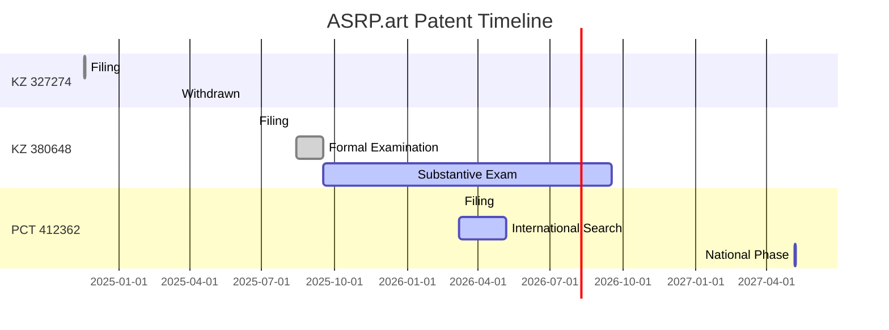

# 🧬 ASRP.art Patent Portfolio - Master Index

**Платформа ноогенетического измерения реакций на искусство**  
**Axionetic Sensing Reactions Platform in Art**

---

## 📊 Repository Overview / Обзор репозитория

| Metric / Метрика | Value / Значение |
|------------------|-----------------|
| **Repository Name** | Kazpatent_Axionetic_Sensing_Reactions_Platform_in_Art_Patent |
| **Visibility** | 🔒 Private / Закрытый |
| **Applications** | 3 (KZ × 2, PCT × 1) |
| **Priority Date** | 24 November 2024 / 24 ноября 2024 |
| **Status** | 🟡 Substantive Examination / Экспертиза по существу |
| **Inventors** | 3 (🇰🇿 KZ, 🇲🇩 MD, 🇩🇪 DE) |
| **Languages** | English + Russian (EN_RU) |
| **Standard** | Fractal Biomedical + ASRP.art Unified |

---

## 🎯 Quick Navigation / Быстрая навигация

| Section / Раздел | Description / Описание | Status / Статус |
|------------------|----------------------|-----------------|
| [**📋 Patent Applications**](#-patent-applications--патентные-заявки) | All 3 applications | ✅ Documented |
| [**📄 Documents**](#-documents--документы) | Uploaded files tracker | ⏳ In Progress |
| [**📅 Timeline**](#-timeline--временная-шкала) | Critical dates | 🟡 Active |
| [**💰 Financial**](#-financial--финансы) | Payments and credits | ✅ Tracked |
| [**👥 Inventors**](#-inventors--изобретатели) | Team info | ✅ Verified |
| [**🔗 Other Repos**](#-related-repositories--связанные-репозитории) | Biophotonic, Fractal, Forecasting | 🟡 Standardizing |

---

## 📋 Patent Applications / Патентные заявки

### Application 1: KZ 327274 ⚠️ WITHDRAWN

| Field / Поле | Value / Значение |
|--------------|-----------------|
| **Number / №** | 2024/0998.1 |
| **Filing Date / Дата** | 18.11.2024 |
| **Status / Статус** | ❌ Withdrawn / Отозвана |
| **Title / Название** | Система оценки произведений искусства через нейрофизиологический анализ... |
| **Priority / Приоритет** | First filing (basis for subsequent) |
| **Documents / Документы** | [`docs/KZ-327274/`](docs/KZ-327274/application.md) |

> **Note:** Withdrawn due to missed deadline. Priority secured via KZ 380648.

---

### Application 2: KZ 380648 ✅ ACTIVE

| Field / Поле | Value / Значение |
|--------------|-----------------|
| **Number / №** | 2025/0592.1 |
| **Filing Date / Дата** | 20.06.2025 |
| **Status / Статус** | 🟡 Substantive Examination |
| **Title / Название** | Платформа ноогенетического измерения реакций на искусство |
| **Priority / Приоритет** | 17.11.2024 (KZ 327274) |
| **Documents / Документы** | [`docs/KZ-380648/`](docs/KZ-380648/application.md) |

**Examination Flow:**
```
Filing ✅ → Formal Exam ✅ → Substantive Exam 🟡 → Grant ⏳ → Publication ⏳
```

---

### Application 3: PCT 412362 🌍 ACTIVE

| Field / Поле | Value / Значение |
|--------------|-----------------|
| **Number / №** | PCT/KZ2026/000010 |
| **Filing Date / Дата** | 07.03.2026 |
| **Status / Статус** | 🟡 International Search |
| **Title / Название** | AXIONETIC SENSING REACTIONS PLATFORM IN ART |
| **ISA** | EPO (European Patent Office) |
| **Documents / Документы** | [`docs/PCT-412362/`](docs/PCT-412362/application.md) |

**Priority Chain:**
```
KZ 327274 (24.11.2024) → KZ 380648 (20.06.2025) → PCT 412362 (07.03.2026)
```

---

## 📄 Documents / Документы

### Upload Status / Статус загрузки

| Category | Total | Uploaded | Progress |
|----------|-------|----------|----------|
| Application Documents | 5 | 0 | 0% |
| Correspondence | 15 | 0 | 0% |
| Payment Records | 5 | 0 | 0% |
| Figures | 3 | 0 | 0% |
| Legal | 3 | 0 | 0% |
| **TOTAL** | **31** | **0** | **0%** |

### 📥 Download from Issues / Загрузить из Issues

**Documents currently attached to Issues:**
- Issue #4: 📅 Patent Timeline & Deadlines Tracker_EN_RU (37 files)
- Issue #5: 💰 Payment & Credit Balance Management_EN_RU (37 files)

**Action Required:**
1. Download all PDF/DOCX files from Issues
2. Rename using standard convention (see `organize_documents.sh`)
3. Upload to appropriate folders
4. Mark ✅ in [`DOCUMENT_UPLOAD_TRACKER.md`](DOCUMENT_UPLOAD_TRACKER.md)

---

## 📅 Timeline / Временная шкала

### Critical Deadlines / Критические дедлайны

| Date | Event | Priority | Status |
|------|-------|----------|--------|
| **~05.2026** | International Search Report (PCT) | 🔴 High | ⏳ Pending |
| **07.09.2026** | Chapter II Demand Deadline | 🟡 Medium | ⏳ Pending |
| **~06.2026** | KZ 380648 Examination Report | 🟡 Medium | ⏳ Expected |
| **07.05.2027** | PCT National Phase Entry | 🔴 CRITICAL | ⏳ Pending |

### Historical Milestones / Исторические вехи



---

## 💰 Financial / Финансы

### Payment Summary / Сводка платежей

| Category / Категория | Amount (KZT) | Status / Статус |
|---------------------|--------------|----------------|
| **Total Paid / Всего оплачено** | 91,002.24 | ✅ Complete |
| **Used / Использовано** | 30,353.12 | - |
| **Available Credit / Доступный кредит** | 60,649.12 | 💳 For future use |

### Payment History / История платежей

| Date | Service | Amount | Receipt | Status |
|------|---------|--------|---------|--------|
| 18.09.2024 | KZ 327274 Filing Fee | 36,544.48 | 208366207 | ✅ Credited |
| 17.09.2025 | KZ 380648 Substantive Exam | 20,088.32 | 933954 | ✅ Used |
| 17.09.2025 | KZ 380648 Accelerated Exam | 24,104.64 | 933954 | ⚠️ Credited |
| 09.11.2025 | PCT Processing Fee | 10,264.80 | 944095 | ✅ Used |

**Detailed Records:** [`payment-receipts/receipts.md`](payment-receipts/receipts.md)

---

## 👥 Inventors / Изобретатели

| # | Name / ФИО | Country / Страна | IIN / ИИН | Role / Роль |
|---|------------|-----------------|-----------|------------|
| 1 | **Банченко Денис Юрьевич** | 🇰🇿 KZ | 800622301483 | Applicant, Inventor |
| 2 | **Овсянникова Валерия Александровна** | 🇲🇩 MD | 001228050911 | Applicant, Inventor |
| 3 | **Капустин Михайло Михайлович** | 🇩🇪 DE | 000623050976 | Applicant, Inventor |

### Correspondence Address / Адрес для переписки

```
БАНЧЕНКО ДЕНИС ЮРЬЕВИЧ
УЛИЦА Комарова 37, 56
КЫЗЫЛОРДИНСКАЯ ОБЛАСТЬ, БАЙКОНЫР
Республика Казахстан, 468320

Phone: +7 705 913 1157
Email: denisbanchenko@asrp.tech
```

---

## 🔗 Related Repositories / Связанные репозитории

### Other ASRP.art Patent Repositories

| Repository | Application | Status | Standard |
|------------|-------------|--------|----------|
| **[Biophotonic](https://github.com/denisbanchenko/Kazpatent_Biophotonic_Neurodiagnostic_System_Patent)** | KZ 2025/1097.1 | 🔒 Private | 🟡 Standardizing |
| **[Fractal](https://github.com/denisbanchenko/Kazpatent_Fractal_Biomedical_System_Patent)** | KZ 2025/1095.1 | 🔒 Private | 🟡 Standardizing |
| **[Forecasting](https://github.com/denisbanchenko/Kazpatent_Global_Forecasting_System_Patent)** | KZ 2025/1096.1 | 🔒 Private | 🟡 Standardizing |

**All repositories being standardized to:**
- ✅ Emoji in Issues (📋 🟡 📅 🔗)
- ✅ Bilingual EN_RU
- ✅ Milestone labels
- ✅ DOCUMENT_UPLOAD_TRACKER.md
- ✅ Unified folder structure

---

## 📊 Repository Structure / Структура репозитория

```
Kazpatent_Axionetic_Sensing_Reactions_Platform_in_Art_Patent/
│
├── 📄 README.md                          # Master index (this file)
├── 📄 DOCUMENT_UPLOAD_TRACKER.md         # Document upload status ✅
├── 📄 organize_documents.sh              # Auto-rename script
│
├── 📂 docs/                              # Patent applications
│   ├── KZ-327274/                        # First national (withdrawn)
│   │   └── application.md
│   ├── KZ-380648/                        # Second national (active)
│   │   └── application.md
│   └── PCT-412362/                       # International (active)
│       └── application.md
│
├── 📂 correspondence/                    # Official communications
│   └── kazpatent/
│       └── correspondence-log.md
│
├── 📂 payment-receipts/                  # Financial records
│   └── receipts.md
│
├── 📂 figures/                           # Technical diagrams
│   └── figures-documentation.md
│
├── 📂 legal/                             # Legal documents
│   └── priority-restoration.md
│
└── 📂 .github/
    └── ISSUE_TEMPLATE/
        ├── patent-application-tracking.md
        ├── correspondence-tracking.md
        └── payment-tracking.md
```

---

## 🚀 Next Actions / Следующие действия

### Immediate (Q2 2026)
- [ ] Download all documents from Issues #4 and #5
- [ ] Rename documents using `organize_documents.sh`
- [ ] Upload to appropriate folders
- [ ] Update [`DOCUMENT_UPLOAD_TRACKER.md`](DOCUMENT_UPLOAD_TRACKER.md) with ✅
- [ ] Monitor PCT International Search Report (~05.2026)

### Short-term (Q3-Q4 2026)
- [ ] Respond to KZ 380648 examination report (if any)
- [ ] Decide on PCT Chapter II demand (deadline: 07.09.2026)
- [ ] Prepare grant fee payment for KZ 380648 (~09.2026)

### Long-term (2027)
- [ ] Select PCT national phase countries (deadline: 07.05.2027)
- [ ] Arrange translations
- [ ] Appoint local patent attorneys
- [ ] Pay national phase fees

---

## 📞 Contact / Контакты

**Repository Maintainer:**  
Denis Banchenko  
📧 denisbanchenko@asrp.tech  
📱 +7 705 913 1157

**Kazpatent Contact:**  
🏢 National Institute of Intellectual Property (NIIS)  
📍 Mangilik El Avenue, Building 57A, Astana, 010000  
📞 (7172) 62-15-15  
🌐 https://qazpatent.kz

---

<div align="center">

**Last Updated:** 22 March 2026  
**Repository:** `Kazpatent_Axionetic_Sensing_Reactions_Platform_in_Art_Patent`  
**Standard:** Fractal Biomedical + ASRP.art Unified  
**Languages:** English + Russian (EN_RU)

---

⭐ *Innovation through Neurophysiological Art Analysis*

</div>
