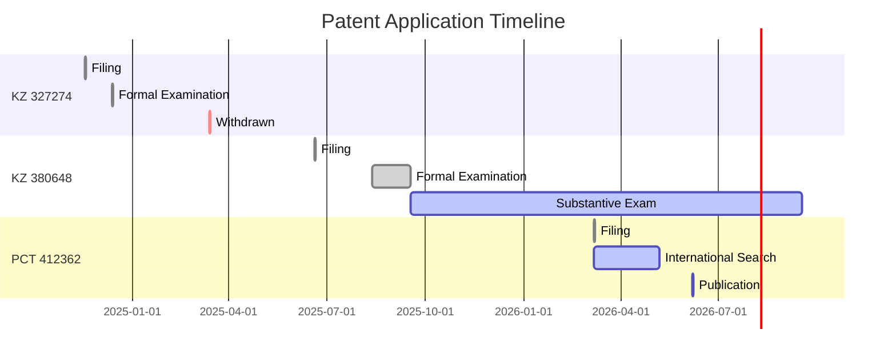

# 🧬 ASRP.art Patent Portfolio

> **Платформа ноогенетического измерения реакций на искусство**  
> **Axionetic Sensing Reactions Platform in Art**

---

## 📊 Repository Overview

| Metric | Value |
|--------|-------|
| **Technology** | Neurophysiological Art Analysis System |
| **Patent Family** | 3 Applications (KZ × 2, PCT × 1) |
| **Priority Date** | 24 November 2024 |
| **Status** | 🟡 Substantive Examination |
| **Inventors** | 3 (KZ, MD, DE) |
| **Total Investment** | 91,002.24 KZT |

---

## 🎯 Quick Navigation

| Section | Description | Status |
|---------|-------------|--------|
| [**📋 Patent Applications**](#-patent-applications) | Complete application documentation | ✅ Active |
| [**📅 Timeline**](#-timeline) | Critical dates and deadlines | 🟡 Monitoring |
| [**💰 Financial Summary**](#-financial-summary) | Payment history and credits | ✅ Tracked |
| [**👥 Inventors**](#-inventors) | Team and contact information | ✅ Verified |
| [**📁 Repository Structure**](#-repository-structure) | Documentation organization | ✅ Complete |
| [**🔬 Technology**](#-technology) | Technical specifications | ✅ Documented |
| [**📞 Correspondence**](#-correspondence) | Official communications log | ✅ Archived |

---

## 📋 Patent Applications

### Application 1: KZ 327274 ⚠️

| Field | Value |
|-------|-------|
| **Number** | `2024/0998.1` |
| **Status** | ❌ Withdrawn (14.03.2025) |
| **Filing Date** | 18.11.2024 |
| **Title** | Система оценки произведений искусства через нейрофизиологический анализ... |
| **Priority** | First filing (basis for subsequent applications) |
| **Documents** | [`/docs/KZ-327274/`](docs/KZ-327274/application.md) |

> **Note:** Withdrawn due to missed deadline. Priority rights secured via KZ 380648.

---

### Application 2: KZ 380648 ✅

| Field | Value |
|-------|-------|
| **Number** | `2025/0592.1` |
| **Status** | 🟡 Substantive Examination |
| **Filing Date** | 20.06.2025 |
| **Title** | Платформа ноогенетического измерения реакций на искусство |
| **Priority** | 17.11.2024 (KZ 327274) |
| **Documents** | [`/docs/KZ-380648/`](docs/KZ-380648/application.md) |

**Current Stage:**
```
Formal Examination ✅ → Substantive Examination 🟡 → Grant Decision ⏳ → Publication ⏳
```

---

### Application 3: PCT 412362 🌍

| Field | Value |
|-------|-------|
| **Number** | `PCT/KZ2026/000010` |
| **Status** | 🟡 International Search |
| **Filing Date** | 07.03.2026 |
| **Title** | AXIONETIC SENSING REACTIONS PLATFORM IN ART |
| **ISA** | EPO (European Patent Office) |
| **Designated States** | 150+ (except DE, JP, KR) |
| **Documents** | [`/docs/PCT-412362/`](docs/PCT-412362/application.md) |

**Priority Chain:**
```
KZ 327274 (24.11.2024) → KZ 380648 (20.06.2025) → PCT 412362 (07.03.2026)
```

---

## 📅 Timeline

### Critical Deadlines

| Date | Event | Priority | Status |
|------|-------|----------|--------|
| **07.09.2026** | PCT Chapter II Demand Deadline | 🔴 High | ⏳ Pending |
| **07.05.2027** | PCT National Phase Entry | 🔴 Critical | ⏳ Pending |
| **~06.2026** | KZ 380648 Examination Report | 🟡 Medium | ⏳ Expected |
| **~09.2026** | KZ 380648 Grant Decision | 🟡 Medium | ⏳ Expected |

### Historical Milestones



---

## 💰 Financial Summary

### Payment Overview

| Category | Amount (KZT) | Status |
|----------|--------------|--------|
| **Total Paid** | 91,002.24 | ✅ Complete |
| **Used** | 30,353.12 | - |
| **Available Credit** | 60,649.12 | 💳 For future use |
| **Refunded** | 0.00 | - |

### Payment History

| Date | Service | Amount | Receipt | Status |
|------|---------|--------|---------|--------|
| 18.09.2024 | KZ 327274 Filing Fee | 36,544.48 | 208366207 | ✅ Credited |
| 17.09.2025 | KZ 380648 Substantive Exam | 20,088.32 | 933954 | ✅ Used |
| 17.09.2025 | KZ 380648 Accelerated Exam | 24,104.64 | 933954 | ⚠️ Credited |
| 09.11.2025 | PCT Processing Fee | 10,264.80 | 944095 | ✅ Used |

**Detailed Records:** [`/payment-receipts/receipts.md`](payment-receipts/receipts.md)

---

## 👥 Inventors

| # | Name | Country | Role | Contact |
|---|------|---------|------|---------|
| **1** | 🇰🇿 Банченко Денис Юрьевич | Kazakhstan | Applicant, Inventor | denisbanchenko@asrp.tech |
| **2** | 🇲🇩 Овсянникова Валерия Александровна | Moldova | Applicant, Inventor | info@asrp.tech |
| **3** | 🇩🇪 Капустин Михайло Михайлович | Germany | Applicant, Inventor | - |

### Correspondence Address

```
БАНЧЕНКО ДЕНИС ЮРЬЕВИЧ
УЛИЦА Комарова 37, 56
КЫЗЫЛОРДИНСКАЯ ОБЛАСТЬ, БАЙКОНЫР
Республика Казахстан, 468320

Phone: +7 705 913 1157
Email: denisbanchenko@asrp.tech
```

---

## 🔬 Technology

### Technical Field

**Neurophysiological Art Analysis System** combining:
- 🧠 EEG & Polysomnography
- 💓 Biometric Sensors (GSR, HRV)
- 🤖 Machine Learning Analysis
- 🔗 NFT Tokenization
- 📊 Emotional-Cognitive Metrics

### Applications

| Domain | Use Case |
|--------|----------|
| 🏛️ Museums | Audience engagement analysis |
| 🎨 Galleries | Artwork impact assessment |
| 🧪 Research | Consciousness studies |
| 🏥 Therapy | Art therapy monitoring |
| 🎓 Education | Creative engagement tracking |
| ⚖️ Legal | Authorship verification |

### Technical Architecture

```
┌─────────────────────────────────────────────────────────────┐
│                    ASRP.art Platform                         │
├─────────────────────────────────────────────────────────────┤
│  ┌──────────┐  ┌──────────┐  ┌──────────┐  ┌──────────┐   │
│  │ Author   │  │ Viewer   │  │ ML       │  │ NFT      │   │
│  │ Sensors  │→ │ Sensors  │→ │ Analysis │→ │ Token    │   │
│  │ (EEG)    │  │ (EEG)    │  │ Engine   │  │ Generator│   │
│  └──────────┘  └──────────┘  └──────────┘  └──────────┘   │
│       ↓             ↓             ↓             ↓          │
│  ┌─────────────────────────────────────────────────────┐   │
│  │          Data Processing & Standardization          │   │
│  └─────────────────────────────────────────────────────┘   │
└─────────────────────────────────────────────────────────────┘
```

**Detailed Specifications:** [`/figures/figures-documentation.md`](figures/figures-documentation.md)

---

## 📁 Repository Structure

```
Kazpatent_Axionetic_Sensing_Reactions_Platform_in_Art_Patent/
│
├── 📄 README.md                          # This file
├── 📄 GITHUB_ISSUES_TO_CREATE.md         # Issue templates
├── 📄 PUSH_INSTRUCTIONS.md               # Deployment guide
│
├── 📂 .github/
│   └── ISSUE_TEMPLATE/
│       ├── patent-application-tracking.md
│       ├── correspondence-tracking.md
│       └── payment-tracking.md
│
├── 📂 docs/                              # Application documentation
│   ├── KZ-327274/                        # First national (withdrawn)
│   │   └── application.md
│   ├── KZ-380648/                        # Second national (active)
│   │   └── application.md
│   └── PCT-412362/                       # International (active)
│       └── application.md
│
├── 📂 correspondence/                    # Official communications
│   └── kazpatent/
│       └── correspondence-log.md
│
├── 📂 figures/                           # Technical diagrams
│   └── figures-documentation.md
│
├── 📂 payment-receipts/                  # Financial records
│   └── receipts.md
│
└── 📂 legal/                             # Legal documents
    ├── priority-claims.md
    └── declarations.md
```

---

## 📞 Correspondence

### Recent Communications

| Date | Type | Counterparty | Subject | Status |
|------|------|--------------|---------|--------|
| 24.09.2025 | Incoming | Kazpatent | Accelerated Exam Rejection | ❌ Denied |
| 20.09.2025 | Outgoing | Kazpatent | Payment Confirmation | ✅ Submitted |
| 17.09.2025 | Incoming | Kazpatent | Positive Formal Examination | ✅ Passed |
| 15.09.2025 | Outgoing | Kazpatent | Response to Query | ✅ Submitted |

**Complete Log:** [`/correspondence/kazpatent/correspondence-log.md`](correspondence/kazpatent/correspondence-log.md)

---

## 🚀 Next Actions

### Immediate (Q2 2026)

- [ ] Monitor PCT International Search Report (~05.2026)
- [ ] Review KZ 380648 Examination Report (~06.2026)
- [ ] Prepare Article 19 Amendments (2 months from ISR)

### Short-term (Q3-Q4 2026)

- [ ] Decide on PCT Chapter II Demand (deadline: 07.09.2026)
- [ ] Respond to KZ 380648 objections (if any)
- [ ] Budget for national phase entry

### Long-term (2027)

- [ ] Select national phase countries (deadline: 07.05.2027)
- [ ] Arrange translations
- [ ] Appoint local patent attorneys
- [ ] Pay national phase fees

---

## 📊 Status Indicators

| Icon | Meaning |
|------|---------|
| ✅ | Complete / Approved |
| 🟡 | In Progress / Pending |
| 🔴 | Critical / Action Required |
| ⏳ | Awaiting / Expected |
| ❌ | Rejected / Failed |
| 🌍 | International |
| 🇰🇿 | Kazakhstan |
| 📄 | Document Available |

---

## 🔗 External Resources

| Resource | Link |
|----------|------|
| **Kazpatent** | https://qazpatent.kz |
| **WIPO PCT** | https://www.wipo.int/pct |
| **PATENTSCOPE** | https://patentscope.wipo.int |
| **EPO** | https://www.epo.org |

---

## 📝 Version History

| Version | Date | Changes |
|---------|------|---------|
| 1.0 | 22.03.2026 | Initial repository creation |
| 1.1 | TBD | Post-ISR updates |

---

## 📧 Contact

**Repository Maintainer:**  
Denis Banchenko  
📧 denisbanchenko@asrp.tech  
📱 +7 705 913 1157

---

<div align="center">

**Last Updated:** 22 March 2026  
**Repository:** `Kazpatent_Axionetic_Sensing_Reactions_Platform_in_Art_Patent`  
**License:** All Rights Reserved

---

⭐ *Innovation through Neurophysiological Art Analysis*

</div>
