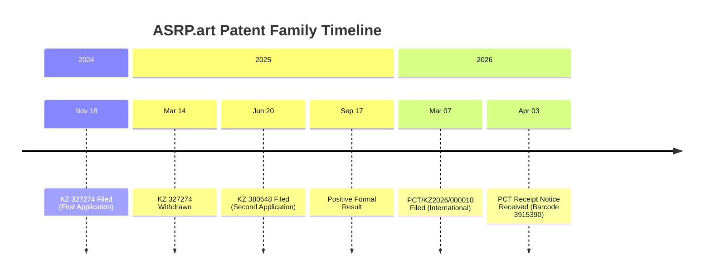
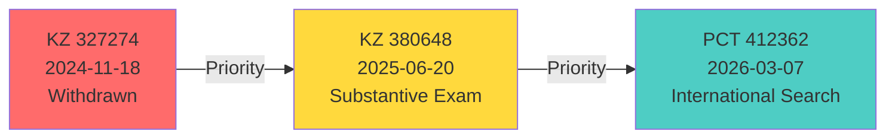

# ASRP.art / ПНИР.Искусство

> **English:** Axionetic Sensing Reactions Platform in Art  
> **Русский:** Платформа ноогенетического измерения реакций на искусство

---

## Repository Overview / Обзор репозитория

| Metric / Метрика | Value / Значение |
|------------------|-----------------|
| **Technology / Технология** | Neurophysiological Art Analysis System / Система нейрофизиологического анализа искусства |
| **Patent Family / Патентное семейство** | 3 Applications (KZ × 2, PCT × 1) / 3 заявки (КЗ × 2, РСТ × 1) |
| **Priority Date / Дата приоритета** | 24 November 2024 / 24 ноября 2024 |
| **Status / Статус** |  Substantive Examination / Экспертиза по существу |
| **Inventors / Изобретатели** | 3 ( KZ,  MD,  DE) |
| **Total Investment / Общие инвестиции** | 91,002.24 KZT / 91,002.24 тенге |

---

## Quick Navigation / Быстрая навигация

| Section / Раздел | Description / Описание | Status / Статус |
|------------------|----------------------|-----------------|
| [** Patent Applications**](#patent-applications--патентные-заявки) | Complete application documentation / Полная документация заявок |  Active / Активно |
| [** Timeline**](#patent-family-timeline--хронология-патентного-семейства) | Critical dates and deadlines / Критические даты и дедлайны |  Monitoring / Мониторинг |
| [** Financial Summary**](#financial-summary--финансовая-сводка) | Payment history and credits / История платежей и кредиты |  Tracked / Отслежено |
| [** Inventors**](#inventors--авторы-изобретатели) | Team and contact information / Информация о команде и контакты |  Verified / Проверено |

---

## Patent Applications / Патентные заявки

### Application 1: KZ 327274  WITHDRAWN / ОТОЗВАНА

| Field / Поле | Value / Значение |
|--------------|-----------------|
| **Number / Номер** | `2024/0998.1` |
| **Status / Статус** |  Withdrawn (14.03.2025) / Отозвана |
| **Filing Date / Дата подачи** | 18.11.2024 |
| **Title / Название** | Система оценки произведений искусства через нейрофизиологический анализ... |
| **Priority / Приоритет** | First filing (basis for subsequent) / Первая заявка (основа для последующих) |
| **Documents / Документы** | [`/docs/KZ-327274/`](docs/KZ-327274/application.md) |

> **Note:** Withdrawn due to missed deadline. Priority rights secured via KZ 380648.  
> **Примечание:** Отозвана из-за пропущенного дедлайна. Приоритет сохранен через KZ 380648.

---

### Application 2: KZ 380648  ACTIVE / АКТИВНА

| Field / Поле | Value / Значение |
|--------------|-----------------|
| **Number / Номер** | `2025/0592.1` |
| **Status / Статус** |  Substantive Examination / Экспертиза по существу |
| **Filing Date / Дата подачи** | 20.06.2025 |
| **Title / Название** | Платформа аксионетического сенсоринга реакций на искусство |
| **Priority / Приоритет** | 17.11.2024 (KZ 327274) |
| **Documents / Документы** | [`/docs/KZ-380648/`](docs/KZ-380648/application.md) |

**Examination Flow / Процесс экспертизы:**
```
Filing   Formal Exam   Substantive Exam   Grant   Publication 
Подача   Формальная   По существу   Выдача   Публикация 
```

---

### Application 3: PCT 412362  ACTIVE / АКТИВНА

| Field / Поле | Value / Значение |
|--------------|-----------------|
| **Number / Номер** | PCT/KZ2026/000010 |
| **Filing Date / Дата подачи** | 07.03.2026 |
| **Status / Статус** |  Receipt Notice Received (03.04.2026) / Уведомление о получении получено (03.04.2026) |
| **Title / Название** | AXIONETIC SENSING REACTIONS PLATFORM IN ART |
| **ISA / МПО** | EPO (European Patent Office / Европейское патентное ведомство) |
| **Documents / Документы** | [`/docs/PCT-412362/`](docs/PCT-412362/application.md) |

**Priority Chain / Цепочка приоритета:**
```
KZ 327274 (24.11.2024)  KZ 380648 (20.06.2025)  PCT 412362 (07.03.2026)
```

---

## Documents / Документы

### Upload Status / Статус загрузки

| Category / Категория | Total / Всего | Uploaded / Загружено | Progress / Прогресс |
|---------------------|---------------|---------------------|---------------------|
| **Application Documents / Документы заявки** | 15 | 15  | 100% |
| **Correspondence / Переписка** | 13 | 13  | 100% |
| **Payment Records / Платежи** | 5 | 5  | 100% |
| **Figures / Чертежи** | 4 | 4  | 100% |
| **Legal / Юридические** | 2 | 2  | 100% |
| **TOTAL / ИТОГО** | **39** | **39 ** | **100% ** |

**Location / Расположение:** Issues #4 and #5 / Issues #4 и #5

### Incoming Correspondence / Входящая переписка

| Date / Дата | Document / Документ | Barcode / Штрихкод | Direct Link / Прямая Ссылка |
|-------------|-------|---------|------|
| 2024-12-13 | Formal Exam Request KZ 327274 / Запрос формальной экспертизы | 3375286 | [PDF](correspondence/incoming/2024-12-13_Incoming_KZ327274_FormalExamRequest_Barcode3375286.pdf) |
| 2025-03-14 | Withdrawal Notice KZ 327274 / Уведомление об отзыве | 3472173 | [PDF](correspondence/incoming/2025-03-14_Incoming_KZ327274_WithdrawalNotice_Barcode3472173.pdf) |
| 2025-07-16 | Expansion Petition Response KZ 380648 / Ответ на ходатайство о расширении | 3600775 | [PDF](correspondence/incoming/2025-07-16_Incoming_KZ380648_ExpansionPetitionResponse_Barcode3600775.pdf) |
| 2025-08-13 | Formal Exam Query KZ 380648 / Запрос формальной экспертизы | 3630582 | [PDF](correspondence/incoming/2025-08-13_Incoming_KZ380648_FormalExamQuery_Barcode3630582.pdf) |
| 2025-09-17 | Positive Formal Result KZ 380648 / Положительный результат формальной экспертизы | 3670459 | [PDF](correspondence/incoming/2025-09-17_Incoming_KZ380648_PositiveFormalResult_Barcode3670459.pdf) |
| 2025-09-24 | Accelerated Exam Rejection KZ 380648 / Отказ в ускоренной экспертизе | 3678502 | [PDF](correspondence/incoming/2025-09-24_Incoming_KZ380648_AcceleratedExamRejection_Barcode3678502.pdf) |
| 03.04.2026 | PCT Receipt Notice / Уведомление о получении PCT заявки | 3915390 | [PDF](correspondence/incoming/2026-04-03_Incoming_PCT412362_ReceiptNotice_Barcode3915390.pdf) |

---

## Financial Summary / Финансовая сводка

### Payment Overview / Обзор платежей

| Category / Категория | Amount (KZT) / Сумма | Status / Статус |
|---------------------|---------------------|-----------------|
| **Total Paid / Всего оплачено** | 91,002.24 |  Complete / Завершено |
| **Used / Использовано** | 30,353.12 | - |
| **Available Credit / Доступный кредит** | 60,649.12 |  For future use / Для будущего использования |

---

## INVENTORS / АВТОРЫ-ИЗОБРЕТАТЕЛИ

**All inventors are equal co-authors / Все авторы-изобретатели являются равными соавторами:**

| # | Name / ФИО | Country / Страна | BIN-IIN / БИН-ИИН | Email | Contribution / Вклад |
|---|------------|------------------|-------------------|-------|---------------------|
| 1 | **OVSEANNICOVA VALERIA ALEXANDROVNA** / **ОВСЯННИКОВА ВАЛЕРИЯ АЛЕКСАНДРОВНА** |  MD | 001228050911 | valeriaovseannicova@asrp.tech | Biomedical validation, clinical testing protocols, regulatory compliance / Биомедицинская валидация, протоколы клинических испытаний, регуляторное соответствие |
| 2 | **BANCHENKO DENIS YURIEVICH** / **БАНЧЕНКО ДЕНИС ЮРЬЕВИЧ** |  KZ | 800622301483 | denisbanchenko@asrp.tech | System architecture, neurophysiological art analysis platform, axionetic sensing method / Архитектура системы, платформа нейрофизиологического анализа искусства, метод аксионетического зондирования |
| 3 | **KAPUSTIN MYKHAILO MYKHALOVICH** / **КАПУСТИН МИХАЙЛО МИХАЙЛОВИЧ** |  DE | 000623050976 | mykhailokapustin@asrp.tech | Neural network models, AI algorithms for art perception analysis / Модели нейронных сетей, AI алгоритмы для анализа восприятия искусства |

**Corporate Contact / Корпоративный контакт:** info@asrp.tech

**Correspondence Address / Адрес для переписки:**
```
ТОО "Перспективные Научно-Исследовательские Разработки"
УЛИЦА Комарова 37, 56
КЫЗЫЛОРДИНСКАЯ ОБЛАСТЬ, БАЙКОНУР
Республика Казахстан, 468320
Телефон: +77059131157
E-mail: info@asrp.tech
```

---

## Patent Family Timeline / Хронология патентного семейства



---

## Priority Chain / Цепочка приоритета



---

## Data Structure / Структура данных

```
Kazpatent_Axionetic_Sensing_Reactions_Platform_in_Art_Patent/
 README.md
 DOCUMENT_INDEX_EN_RU.md
 DOCUMENT_UPLOAD_TRACKER.md
 FILE_INDEX_WITH_LINKS_EN_RU.md
 MASTER_INDEX.md
 archive/
    figures-documentation.md
 correspondence/
    CORRESPONDENCE_FLOW_EN_RU.md
    incoming/
       2024-12-13_Incoming_KZ327274_FormalExamRequest_Barcode3375286.pdf
       2025-03-14_Incoming_KZ327274_WithdrawalNotice_Barcode3472173.pdf
       2025-07-16_Incoming_KZ380648_ExpansionPetitionResponse_Barcode3600775.pdf
       2025-08-13_Incoming_KZ380648_FormalExamQuery_Barcode3630582.pdf
       2025-09-17_Incoming_KZ380648_PositiveFormalResult_Barcode3670459.pdf
       2025-09-24_Incoming_KZ380648_AcceleratedExamRejection_Barcode3678502.pdf
       2026-04-03_Incoming_PCT412362_ReceiptNotice_Barcode3915390.pdf
    outgoing/
        2025-07-11_Outgoing_KZ380648_ExpansionPetition_BWTC_Metaverse_Iskh2025-41646.pdf
        2025-09-15_Outgoing_KZ380648_ResponseToFormalExam_Iskh9.pdf
        2025-09-20_Outgoing_KZ380648_ResponseToPaymentNotice_Iskh20.pdf
 docs/
    APPLICATIONS_SUMMARY_EN_RU.md
    abstracts/
       2025-06-20_Abstract_KZ380648_v1_Original_RU.doc
       2025-09-15_Abstract_KZ380648_v2_Final_RU.pdf
       2025-09-15_Abstract_KZ380648_v2_Revised_RU.doc
       2026-03-07_Abstract_PCT412362_v1_Editable_RU.docx
    applications/
       2024-11-18_Application_KZ327274_v1_Original_RU.pdf
       2025-06-20_Application_KZ380648_v1_Original_RU.pdf
       2026-03-07_Application_PCT412362_v1_Original_RU_EN.pdf
    claims/
       2025-06-20_Claims_KZ380648_v1_Original_RU.doc
       2025-09-15_Claims_KZ380648_v2_Final_RU.pdf
       2025-09-15_Claims_KZ380648_v2_Revised_RU.doc
       2026-03-07_Claims_PCT412362_v1_Editable_RU.docx
    descriptions/
       2025-06-20_Description_KZ380648_v1_Original_RU.doc
       2025-09-15_Description_KZ380648_v2_Final_RU.pdf
       2025-09-15_Description_KZ380648_v2_Revised_RU.doc
       2026-03-07_Description_PCT412362_v1_Editable_RU.docx
       2026-03-07_Description_PCT412362_v1_Original_RU.doc
    drawings/
        2025-09-15_Figure1_FunctionalDiagram_ASRP.art.pdf
        2025-09-15_Figure2_EEGProcessingAlgorithm_ASRP.art.pdf
        2025-09-15_Figure3_NFTStructure_BiometricMetadata_ASRP.art.pdf
 INBOX/
 legal/
    2026-03-07_Petition_PriorityRestoration_KZ327274_PCT412362_RU_EN.pdf
    correspondence-log.md
 payment-receipts/
    2024-09-18_Payment_KZ327274_FilingFee_36544.48KZT_208366207.pdf
    2025-09-17_BankStatement_KZ380648_Payment_44192.96KZT_Card4290.pdf
    2025-09-17_Payment_KZ380648_SubstantiveExam_44192.96KZT_933954.pdf
    2025-11-09_Payment_PCT412362_ProcessingFee_10264.80KZT_944095.pdf
    receipts.md
 translations/
     README_TRANSLATIONS.md
```

---

## Active Issues / Активные задачи

| # | State / Статус | Title / Название | Labels / Метки |
|---|---------------|-----------------|----------------|
| 6 | OPEN |  ВХОДЯЩИЕ - Репозиторий Документов / INCOMING - Document Repository (33 файла) | `documentation`, `upload`, `EN_RU`, `inbox` |
| 5 | OPEN |  Платежи и Кредитный Баланс / Payments and Credit Balance | `tracking`, `payment`, `credit`, `financial-planning` |
| 4 | OPEN |  Временная Шкала и Дедлайны / Timeline and Deadlines | `pct`, `deadline`, `critical`, `national-phase` |
| 3 | OPEN |  PCT412362 - Платформа Ноогенетического Измерения / Platform for Noogenetic Measurement (PCT International) | `patent`, `tracking`, `active`, `pct`, `international` |
| 2 | OPEN |  KZ380648 - Платформа Ноогенетического Измерения Реакций / Platform for Noogenetic Measurement of Reactions | `patent`, `tracking`, `active`, `substantive-examination` |
| 1 | OPEN |  KZ327274 - Система Оценки Произведений Искусства / System for Evaluating Works of Art (Отозвано / Withdrawn) | `patent`, `tracking`, `withdrawn`, `priority` |

---

## Related Repositories / Связанные репозитории

### Patent Repositories / Патентные репозитории

| Repository / Репозиторий | Description / Описание | Status / Статус |
|-------------------------|----------------------|-----------------|
| **[ASRP.art (this repo)](https://github.com/denisbanchenko/Kazpatent_Axionetic_Sensing_Reactions_Platform_in_Art_Patent)** | Axionetic Sensing Reactions Platform in Art / Платформа аксионетического сенсоринга реакций на искусство |  Active |
| **[Biophotonic](https://github.com/denisbanchenko/Kazpatent_Biophotonic_Neurodiagnostic_System_Patent)** | Biophotonic Optical Neurodiagnostic System / Биофотонная оптическая нейродиагностическая система (KZ 2025/1097.1) |  Private |
| **[Fractal](https://github.com/denisbanchenko/Kazpatent_Fractal_Biomedical_System_Patent)** | Fractal Biomedical Hyperbolic Field System / Фрактальная биомедицинская система гиперболического поля (KZ 2025/1095.1) |  Private |
| **[Forecasting](https://github.com/denisbanchenko/Kazpatent_Global_Forecasting_System_Patent)** | Global Forecasting System / Система глобального прогнозирования (KZ 2025/1096.1) |  Private |
| **[Body Food System](https://github.com/denisbanchenko/Kazpatent_Body_Food_System_Patent)** | Body Food System by Genetic Code / Система пищевого продукта по генетическому коду |  Private |
| **[INSPIRA-X](https://github.com/denisbanchenko/Kazpatent_Inspira-X_Respiratory_Analysis_Patent)** | Intelligent Neural Specialized Programmatic Instrument for Respiratory Analysis (KZ 2025/0914.1) |  Private |
| **[ASRP.drift](https://github.com/denisbanchenko/Kazpatent_Advanced_Synchro_Resonance_Platform_For_Deep_Resonant_Patent)** | Advanced Synchro Resonance Platform for Deep Resonant Integration of Fielded Thought (KZ 413554) |  Private |

---

## Navigation Index / Навигационный указатель

| Section / Раздел | Link / Ссылка |
|------------------|--------------|
| Repository Overview / Обзор репозитория | [Go / Перейти](#repository-overview--обзор-репозитория) |
| Patent Applications / Патентные заявки | [Go / Перейти](#patent-applications--патентные-заявки) |
| Documents / Документы | [Go / Перейти](#documents--документы) |
| Financial Summary / Финансовая сводка | [Go / Перейти](#financial-summary--финансовая-сводка) |
| Inventors / Авторы-изобретатели | [Go / Перейти](#inventors--авторы-изобретатели) |
| Patent Family Timeline / Хронология патентного семейства | [Go / Перейти](#patent-family-timeline--хронология-патентного-семейства) |
| Priority Chain / Цепочка приоритета | [Go / Перейти](#priority-chain--цепочка-приоритета) |
| Data Structure / Структура данных | [Go / Перейти](#data-structure--структура-данных) |
| Active Issues / Активные задачи | [Go / Перейти](#active-issues--активные-задачи) |
| Related Repositories / Связанные репозитории | [Go / Перейти](#related-repositories--связанные-репозитории) |

---

<div align="center">

**Last Updated / Последнее обновление:** 04 April 2026 / 04 апреля 2026  
**Repository / Репозиторий:** `Kazpatent_Axionetic_Sensing_Reactions_Platform_in_Art_Patent`  
**Standard / Стандарт:** Fully Bilingual EN_RU / Полностью двуязычный

</div>
