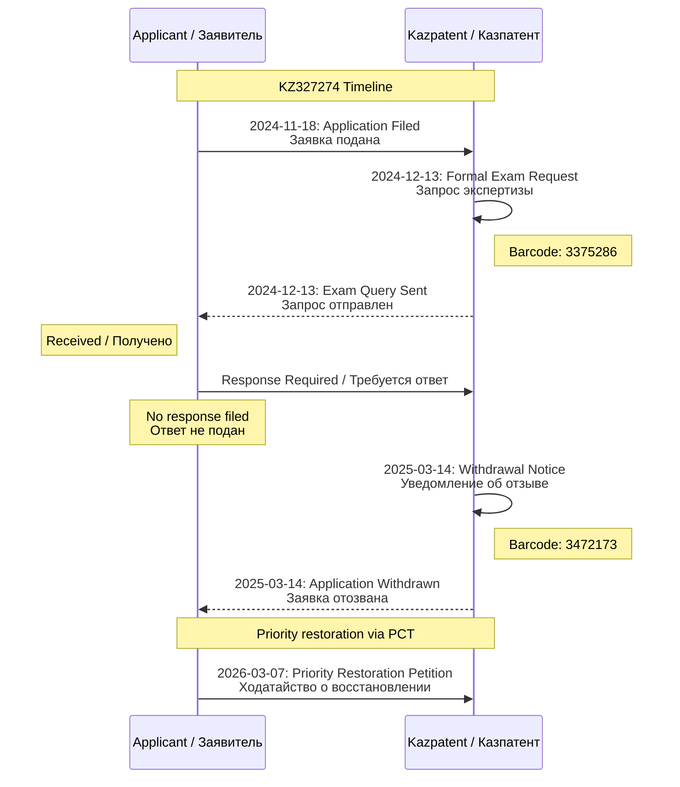
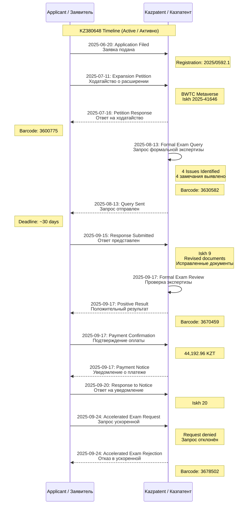
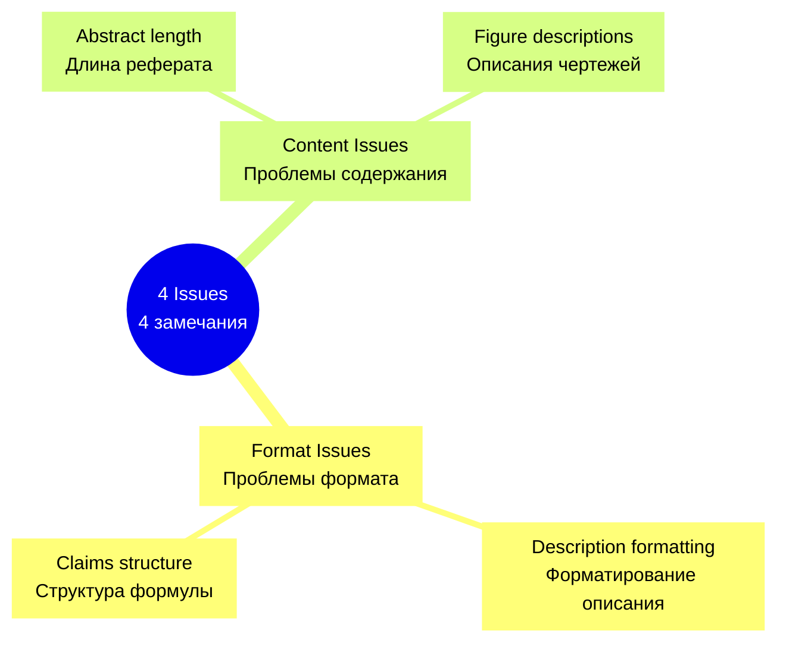
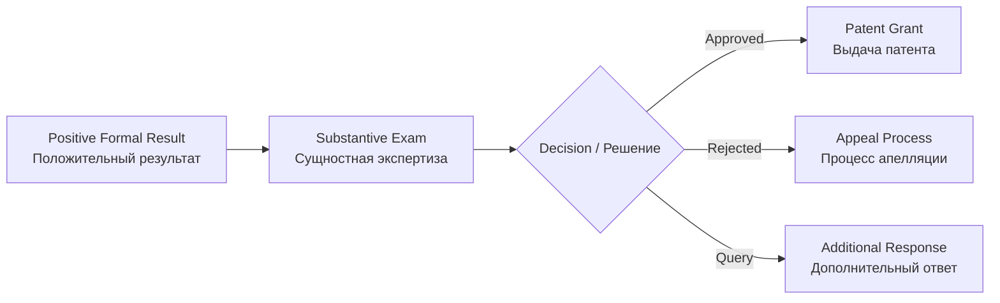
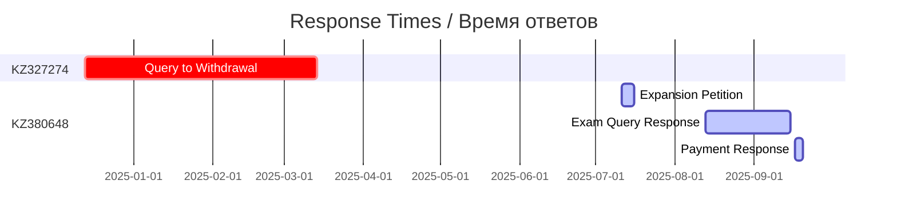

# 📨 CORRESPONDENCE FLOW / ПОТОК ПЕРЕПИСКИ

**Source Directory / Исходная директория:** `inbox-renamed-documents/`  
**Total Correspondence Files / Всего файлов переписки:** 9 (6 Incoming + 3 Outgoing)

---

## CORRESPONDENCE OVERVIEW / ОБЗОР ПЕРЕПИСКИ

### KZ327274 Correspondence Flow / Поток переписки KZ327274

**Source Documents / Исходные документы:**
- `inbox-renamed-documents/2024-12-13_Incoming_KZ327274_FormalExamRequest_Barcode3375286.pdf`
- `inbox-renamed-documents/2025-03-14_Incoming_KZ327274_WithdrawalNotice_Barcode3472173.pdf`
- `inbox-renamed-documents/2026-03-07_Petition_PriorityRestoration_KZ327274_PCT412362_RU_EN.pdf`

---

### KZ380648 Correspondence Flow / Поток переписки KZ380648

**Source Documents / Исходные документы:**
- `inbox-renamed-documents/2025-07-11_Outgoing_KZ380648_ExpansionPetition_BWTC_Metaverse_Iskh2025-41646.pdf`
- `inbox-renamed-documents/2025-07-16_Incoming_KZ380648_ExpansionPetitionResponse_Barcode3600775.pdf`
- `inbox-renamed-documents/2025-08-13_Incoming_KZ380648_FormalExamQuery_Barcode3630582.pdf`
- `inbox-renamed-documents/2025-09-15_Outgoing_KZ380648_ResponseToFormalExam_Iskh9.pdf`
- `inbox-renamed-documents/2025-09-17_Incoming_KZ380648_PositiveFormalResult_Barcode3670459.pdf`
- `inbox-renamed-documents/2025-09-20_Outgoing_KZ380648_ResponseToPaymentNotice_Iskh20.pdf`
- `inbox-renamed-documents/2025-09-24_Incoming_KZ380648_AcceleratedExamRejection_Barcode3678502.pdf`

---

## DETAILED CORRESPONDENCE ANALYSIS / ДЕТАЛЬНЫЙ АНАЛИЗ ПЕРЕПИСКИ

### 1. Formal Examination Query / Запрос формальной экспертизы

**Document / Документ:** `2025-08-13_Incoming_KZ380648_FormalExamQuery_Barcode3630582.pdf`

**EN:** Kazpatent formal examination identified 4 issues requiring correction before proceeding to substantive examination.

**RU:** Формальная экспертиза Казпатент выявила 4 замечания, требующих исправления перед переходом к substantive экспертизе.

#### Issues Identified / Выявленные замечания

**Response / Ответ:** `2025-09-15_Outgoing_KZ380648_ResponseToFormalExam_Iskh9.pdf`

**Timeline / Сроки:**
- Query Received: 2025-08-13
- Response Filed: 2025-09-15
- **Response Time: 33 days** (within allowed period)

---

### 2. Expansion Petition / Ходатайство о расширении

**Document / Документ:** `2025-07-11_Outgoing_KZ380648_ExpansionPetition_BWTC_Metaverse_Iskh2025-41646.pdf`

**EN:** Petition to expand patent protection to include BWTC Metaverse integration for the ASRP.art system.

**RU:** Ходатайство о расширении патентной защиты для включения интеграции BWTC Metaverse для системы ASRP.art.

#### Petition Details / Детали ходатайства

| Field / Поле | Value / Значение |
|-------------|-----------------|
| **Outgoing Number / Исходящий номер** | 2025-41646 |
| **Subject / Тема** | BWTC Metaverse Integration |
| **Filing Date / Дата подачи** | 2025-07-11 |
| **Response Date / Дата ответа** | 2025-07-16 |
| **Response Time / Время ответа** | 5 days |

**Response / Ответ:** `2025-07-16_Incoming_KZ380648_ExpansionPetitionResponse_Barcode3600775.pdf`

---

### 3. Positive Formal Result / Положительный результат формальной экспертизы

**Document / Документ:** `2025-09-17_Incoming_KZ380648_PositiveFormalResult_Barcode3670459.pdf`

**EN:** Official notification that the application has passed formal examination and is accepted for substantive examination.

**RU:** Официальное уведомление о том, что заявка прошла формальную экспертизу и принята к substantive экспертизе.

#### Next Steps / Следующие шаги

---

### 4. Payment Notice Response / Ответ на уведомление о платеже

**Document / Документ:** `2025-09-20_Outgoing_KZ380648_ResponseToPaymentNotice_Iskh20.pdf`

**EN:** Response to Kazpatent notice regarding payment confirmation for substantive examination fee.

**RU:** Ответ на уведомление Казпатент относительно подтверждения оплаты за substantive экспертизу.

**Timeline / Сроки:**
- Notice Received: 2025-09-17
- Response Filed: 2025-09-20
- **Response Time: 3 days**

---

### 5. Accelerated Examination Rejection / Отказ в ускоренной экспертизе

**Document / Документ:** `2025-09-24_Incoming_KZ380648_AcceleratedExamRejection_Barcode3678502.pdf`

**EN:** Request for accelerated examination was denied. Application will proceed through standard examination timeline.

**RU:** Запрос на ускоренную экспертизу был отклонен. Заявка будет проходить через стандартную линию времени экспертизы.

**Reason / Причина:**
- **EN:** Application does not meet criteria for accelerated examination under Kazakhstani patent law.
- **RU:** Заявка не соответствует критериям для ускоренной экспертизы по патентному праву Казахстана.

---

## CORRESPONDENCE SUMMARY TABLE / ТАБЛИЦА СВОДКИ ПЕРЕПИСКИ

| # | Date / Дата | Type / Тип | Direction / Направление | Subject / Тема | Barcode/Iskh |
|---|-------------|-----------|------------------------|---------------|--------------|
| 1 | 2024-12-13 | Incoming | KZ→Applicant | Formal Exam Request | 3375286 |
| 2 | 2025-03-14 | Incoming | KZ→Applicant | Withdrawal Notice | 3472173 |
| 3 | 2025-07-11 | Outgoing | Applicant→KZ | Expansion Petition | 2025-41646 |
| 4 | 2025-07-16 | Incoming | KZ→Applicant | Expansion Response | 3600775 |
| 5 | 2025-08-13 | Incoming | KZ→Applicant | Formal Exam Query | 3630582 |
| 6 | 2025-09-15 | Outgoing | Applicant→KZ | Response to Query | 9 |
| 7 | 2025-09-17 | Incoming | KZ→Applicant | Positive Result | 3670459 |
| 8 | 2025-09-20 | Outgoing | Applicant→KZ | Payment Response | 20 |
| 9 | 2025-09-24 | Incoming | KZ→Applicant | Accelerated Rejection | 3678502 |

---

## RESPONSE TIME ANALYSIS / АНАЛИЗ ВРЕМЕНИ ОТВЕТА

### Average Response Times / Среднее время ответов

| Party / Сторона | Average Time / Среднее время |
|----------------|------------------------------|
| **Kazpatent / Казпатент** | 5-30 days |
| **Applicant / Заявитель** | 3-33 days |

---

## BARCODE REFERENCE / СПРАВОЧНИК ШТРИХКОДОВ

All incoming documents from Kazpatent include barcodes for tracking:

| Barcode | Document / Документ | Date / Дата |
|---------|-------------------|-------------|
| 3375286 | Formal Exam Request | 2024-12-13 |
| 3472173 | Withdrawal Notice | 2025-03-14 |
| 3600775 | Expansion Response | 2025-07-16 |
| 3630582 | Formal Exam Query | 2025-08-13 |
| 3670459 | Positive Result | 2025-09-17 |
| 3678502 | Accelerated Rejection | 2025-09-24 |

---

*Generated by ASRP.art Document Management System*  
**Last Updated:** 23 March 2026
