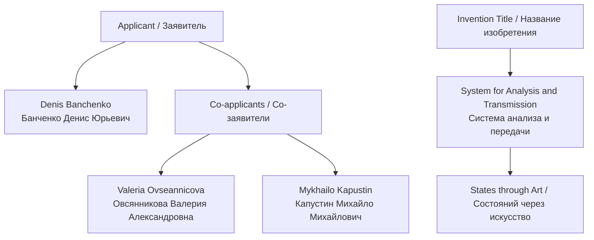
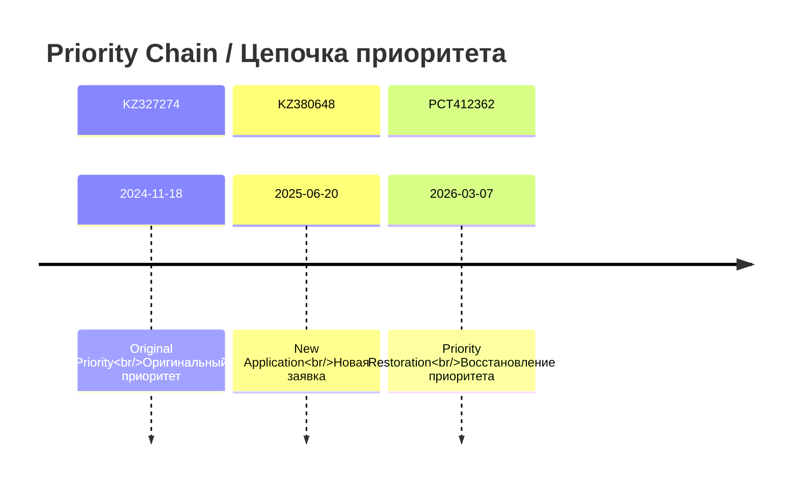
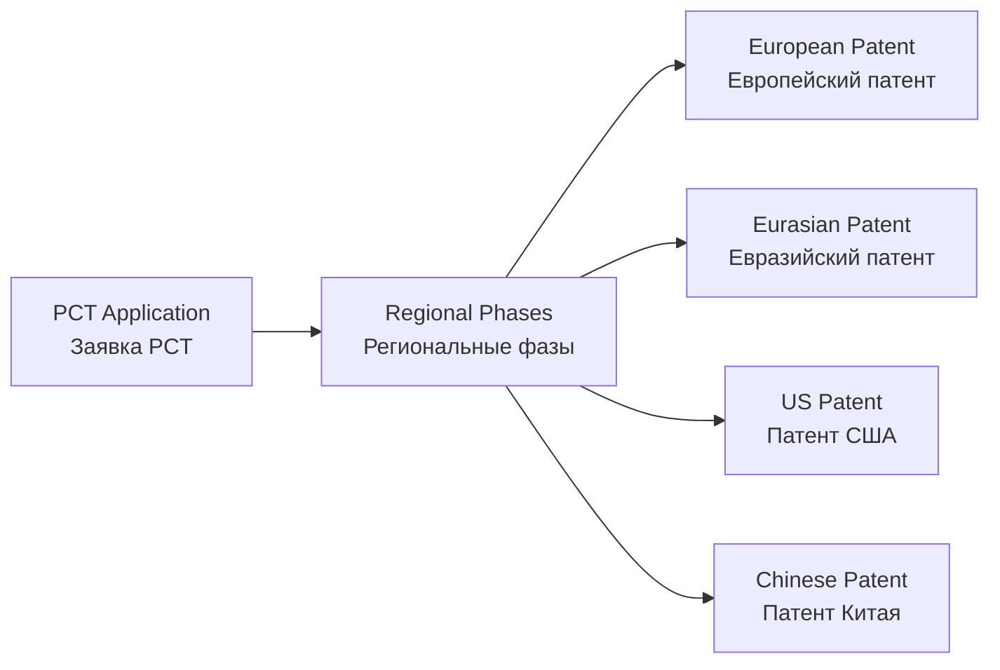
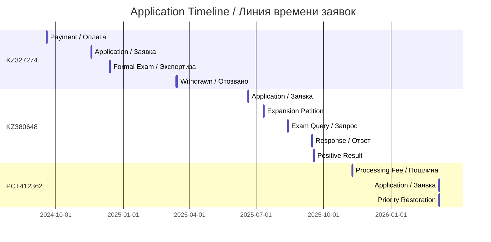

# 📄 APPLICATIONS DOCUMENT SUMMARY / СВОДКА ДОКУМЕНТОВ ЗАЯВОК

**Source Directory / Исходная директория:** `inbox-renamed-documents/`  
**Total Application Files / Всего файлов заявлений:** 3

---

## DOCUMENT 1 / ДОКУМЕНТ 1

### File / Файл
`2024-11-18_Application_KZ327274_v1_Original_RU.pdf`

### Application Details / Детали заявки
| Field / Поле | Value / Значение |
|-------------|-----------------|
| **Application Number / Номер заявки** | KZ 327274 |
| **Filing Date / Дата подачи** | 2024-11-18 |
| **Language / Язык** | Russian (RU) |
| **Status / Статус** | ❌ Withdrawn / Отозвано |
| **Applicant / Заявитель** | Denis Banchenko |

### Document Contents / Содержание документа

**EN:** Application for the issuance of a patent of the Republic of Kazakhstan for invention. Filed by Denis Banchenko for the system of analysis and transmission of states through works of art.

**RU:** Заявление о выдаче патента Республики Казахстан на изобретение. Подано Банченко Денисом Юрьевичем на систему анализа и передачи состояний через произведения искусства.

### Key Information / Ключевая информация

### Related Documents / Связанные документы
- Payment: `2024-09-18_Payment_KZ327274_FilingFee_36544.48KZT_208366207.pdf`
- Formal Exam Request: `2024-12-13_Incoming_KZ327274_FormalExamRequest_Barcode3375286.pdf`
- Withdrawal Notice: `2025-03-14_Incoming_KZ327274_WithdrawalNotice_Barcode3472173.pdf`

---

## DOCUMENT 2 / ДОКУМЕНТ 2

### File / Файл
`2025-06-20_Application_KZ380648_v1_Original_RU.pdf`

### Application Details / Детали заявки
| Field / Поле | Value / Значение |
|-------------|-----------------|
| **Application Number / Номер заявки** | KZ 380648 |
| **Filing Date / Дата подачи** | 2025-06-20 |
| **Language / Язык** | Russian (RU) |
| **Status / Статус** | ✅ Active / Активно |
| **Applicant / Заявитель** | Denis Banchenko |

### Document Contents / Содержание документа

**EN:** Second application for the issuance of a patent of the Republic of Kazakhstan for invention. Filed after withdrawal of KZ 327274, with revised claims and description.

**RU:** Вторая заявка на выдачу патента Республики Казахстан на изобретение. Подана после отзыва KZ 327274, с исправленной формулой и описанием.

### Priority Claim / Притязание на приоритет

### Related Documents / Связанные документы
- Description: `2025-06-20_Description_KZ380648_v1_Original_RU.doc`
- Claims: `2025-06-20_Claims_KZ380648_v1_Original_RU.doc`
- Abstract: `2025-06-20_Abstract_KZ380648_v1_Original_RU.doc`

---

## DOCUMENT 3 / ДОКУМЕНТ 3

### File / Файл
`2026-03-07_Application_PCT412362_v1_Original_RU_EN.pdf`

### Application Details / Детали заявки
| Field / Поле | Value / Значение |
|-------------|-----------------|
| **Application Number / Номер заявки** | PCT 412362 |
| **Filing Date / Дата подачи** | 2026-03-07 |
| **Language / Язык** | Russian/English (RU/EN) |
| **Status / Статус** | 🌍 Pending / В ожидании |
| **Type / Тип** | International Application / Международная заявка |

### Document Contents / Содержание документа

**EN:** International patent application filed under the Patent Cooperation Treaty (PCT). Claims priority from KZ 327274 (withdrawn) for international protection.

**RU:** Международная патентная заявка, поданная в соответствии с Договором о патентной кооперации (PCT). Притязает на приоритет от KZ 327274 (отозвано) для международной защиты.

### PCT Designated States / Указанные государства PCT

### Priority Restoration / Восстановление приоритета

**Legal Basis / Правовая основа:** PCT Rule 26bis.3

**EN:** Request for restoration of priority right due to unintentional failure to file within priority period.

**RU:** Ходатайство о восстановлении права на приоритет из-за непреднамеренной неподачи в течение периода приоритета.

### Related Documents / Связанные документы
- Priority Restoration: `2026-03-07_Petition_PriorityRestoration_KZ327274_PCT412362_RU_EN.pdf`
- Processing Fee: `2025-11-09_Payment_PCT412362_ProcessingFee_10264.80KZT_944095.pdf`

---

## APPLICATION COMPARISON TABLE / ТАБЛИЦА СРАВНЕНИЯ ЗАЯВОК

| Feature / Характеристика | KZ327274 | KZ380648 | PCT412362 |
|-------------------------|----------|----------|-----------|
| **Filing Date / Дата подачи** | 2024-11-18 | 2025-06-20 | 2026-03-07 |
| **Status / Статус** | ❌ Withdrawn | ✅ Active | 🌍 Pending |
| **Language / Язык** | RU | RU | RU/EN |
| **Priority Date / Дата приоритета** | 2024-11-18 | 2025-06-20 | Claims 2024-11-18 |
| **Fee Paid / Пошлина уплачена** | 36,544.48 KZT | 44,192.96 KZT | 10,264.80 KZT |
| **Formal Exam Result / Результат экспертизы** | Withdrawn | Positive | Pending |

---

## KEY DATES TIMELINE / ЛИНИЯ ВРЕМЕНИ КЛЮЧЕВЫХ ДАТ

---

*Generated by ASRP.art Document Management System*  
**Last Updated:** 23 March 2026
