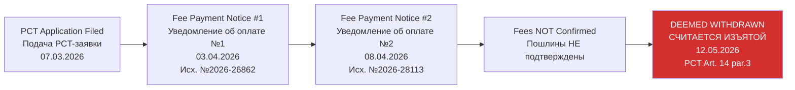

# WITHDRAWAL NOTICE — INTERNATIONAL APPLICATION DEEMED WITHDRAWN / УВЕДОМЛЕНИЕ — МЕЖДУНАРОДНАЯ ЗАЯВКА СЧИТАЕТСЯ ИЗЪЯТОЙ

**Kazpatent Official Document / Официальный Документ Казпатент**

---

## DOCUMENT INFORMATION / ИНФОРМАЦИЯ О ДОКУМЕНТЕ

| Field / Поле | Value / Значение |
|-------------|-----------------|
| **Document Type / Тип Документа** | УВ-1 Уведомление — международная заявка считается изъятой / Notification — international application deemed withdrawn |
| **Application Number / Номер Заявки** | PCT/KZ2026/000010 |
| **Outgoing Number / Исходящий Номер** | Исх. № 2026-37767 |
| **Date / Дата** | 12 May 2026 / 12 мая 2026 |
| **Direction / Направление** | Incoming / Входящий |
| **From / От** | Kazpatent (NIIS — National Institute of Intellectual Property, Ministry of Justice of RK) |
| **To / Кому** | Овсянникова Валерия Александровна, Chișinău (Кишенёв), ул. Даячия 5, кв. 107 |
| **Signed By / Подписано** | О. Жұбанов — Заместитель руководителя управления (Deputy Head of Department), ЭЦП |

---

## PROCEDURAL STATUS / ПРОЦЕССУАЛЬНЫЙ СТАТУС

---

## FULL RUSSIAN ORIGINAL / ПОЛНЫЙ РУССКИЙ ОРИГИНАЛ

**Исходящий заголовок (двуязычный)**

ҚАЗАҚСТАН РЕСПУБЛИКАСЫ ӘДІЛЕТ МИНИСТРЛІГІ ЗИЯТКЕРЛІК МЕНШІК ҚҰҚЫҒЫ КОМИТЕТІНІҢ «ҰЛТТЫҚ ЗИЯТКЕРЛІК МЕНШІК ИНСТИТУТЫ» ШАРУАШЫЛЫҚ ЖҮРГІЗУ ҚҰҚЫҒЫНДАҒЫ РЕСПУБЛИКАЛЫҚ МЕМЛЕКЕТТІК КӘСІПОРНЫ

РЕСПУБЛИКАНСКОЕ ГОСУДАРСТВЕННОЕ ПРЕДПРИЯТИЕ НА ПРАВЕ ХОЗЯЙСТВЕННОГО ВЕДЕНИЯ «НАЦИОНАЛЬНЫЙ ИНСТИТУТ ИНТЕЛЛЕКТУАЛЬНОЙ СОБСТВЕННОСТИ» КОМИТЕТА ПО ПРАВАМ ИНТЕЛЛЕКТУАЛЬНОЙ СОБСТВЕННОСТИ МИНИСТЕРСТВА ЮСТИЦИИ РЕСПУБЛИКИ КАЗАХСТАН

010000, г. Астана, район «Есиль», проспект Мангилик Ел, здание 57 А, н.п.8.
Тел: (7172) 62 15 15
https://qazpatent.kz, e-mail: qazpatent@qazpatent.kz

Нысан/Форма УВ-1

**№ 2026-37767, 12.05.2026**

Овсянникова Валерия Александровна
КИШЕНЁВ, УЛИЦА ДАЯЧИЯ 5,
КВАРТИРА 107,
denisbanchenko@asrp.tech

---

Касательно международной заявки PCT/KZ2026/000010 «ПЛАТФОРМА НООГЕНЕТИЧЕСКОГО ИЗМЕРЕНИЯ РЕАКЦИЙ НА ИСКУССТВО» от 07.03.2026 г.

Настоящим сообщаем, что согласно статьи 14(3) Договора о патентной Кооперации в связи с непредоставлением документов, подтверждающих уплаты установленных пошлин (Согласно уведомлениям за исх. № 2026-26862 от 03.04.2026 г. и № 2026-28113 от 08.04.2026 г.) международная заявка PCT/KZ2026/000010 считается изъятой.

---

**Подписано ЭЦП:**
О. Жұбанов (Заместитель руководителя управления)

Данный документ сформирован на основании подписанных данных.

**Данные о подписи:**

| Статус подписи | ФИО | ЭЦП выдал | Срок действия сертификата |
|---------------|-----|-----------|--------------------------|
| Действителен | ЖҰБАНОВ ОЛЖАС НҰРАДИНҰЛЫ | CN=ҰЛТТЫҚ КУӘЛАНДЫРУШЫ ОРТАЛЫҚ (GOST) 2022, C=KZ | 08.10.2025 — 08.10.2026 |

---

## FULL ENGLISH TRANSLATION / ПОЛНЫЙ АНГЛИЙСКИЙ ПЕРЕВОД

**Outgoing header (bilingual)**

REPUBLICAN STATE ENTERPRISE ON THE RIGHT OF ECONOMIC MANAGEMENT "NATIONAL INSTITUTE OF INTELLECTUAL PROPERTY" OF THE COMMITTEE ON INTELLECTUAL PROPERTY RIGHTS OF THE MINISTRY OF JUSTICE OF THE REPUBLIC OF KAZAKHSTAN

010000, Astana, Yesil district, Mangilik El Avenue, Building 57A, p.o.8.
Tel: (7172) 62 15 15
https://qazpatent.kz, e-mail: qazpatent@qazpatent.kz

Form УВ-1

**No. 2026-37767, 12.05.2026**

Ovsyannikova Valeria Alexandrovna
CHISINAU, DACHIA STREET 5,
APARTMENT 107,
denisbanchenko@asrp.tech

---

Re: international application PCT/KZ2026/000010 "PLATFORM FOR NOOGENETIC MEASUREMENT OF REACTIONS TO ART" of 07.03.2026.

We hereby inform you that pursuant to Article 14(3) of the Patent Cooperation Treaty, due to the non-submission of documents confirming payment of the prescribed fees (as per notices No. 2026-26862 of 03.04.2026 and No. 2026-28113 of 08.04.2026), international application PCT/KZ2026/000010 is deemed withdrawn.

---

**Signed with EDS (Electronic Digital Signature):**
O. Zhubanov (Deputy Head of Department)

This document was generated on the basis of signed data.

**Signature data:**

| Signature Status | Full Name | EDS Issued By | Certificate Validity |
|-----------------|-----------|---------------|----------------------|
| Valid | ZHUBANOV OLZHAS NURADINULY | CN=NATIONAL CERTIFICATION AUTHORITY (GOST) 2022, C=KZ | 08.10.2025 — 08.10.2026 |

---

## LEGAL SIGNIFICANCE / ЮРИДИЧЕСКОЕ ЗНАЧЕНИЕ

**EN:** This notice constitutes formal confirmation under PCT Article 14(3) that international application PCT/KZ2026/000010 is **deemed withdrawn** as of 12 May 2026. The PCT route for this patent family is **terminated**. No international search report will be issued and the application will not proceed to the national/regional phase in any designated state. Any further protection strategy must rely on direct national filings made prior to the withdrawal becoming effective, or on alternative prosecution routes.

**RU:** Данное уведомление представляет собой официальное подтверждение в соответствии со статьей 14(3) PCT, что международная заявка PCT/KZ2026/000010 **считается изъятой** с 12 мая 2026 года. PCT-маршрут для данного патентного семейства **прекращён**. Международный поисковый отчёт выдан не будет, и заявка не перейдёт в национальную/региональную фазу ни в одном из указанных государств. Любая дальнейшая стратегия защиты должна опираться на прямые национальные подачи, осуществлённые до вступления отзыва в силу, либо на альтернативные процессуальные маршруты.

---

## RELATED DOCUMENTS / СВЯЗАННЫЕ ДОКУМЕНТЫ

| # | Document / Документ | Date / Дата |
|---|---------------------|-------------|
| 1 | PCT Application / PCT-заявка PCT/KZ2026/000010 | 07.03.2026 |
| 2 | Fee Payment Notice #1 / Уведомление об оплате пошлин №1 (Исх. №2026-26862) | 03.04.2026 |
| 3 | Fee Payment Notice #2 / Уведомление об оплате пошлин №2 (Исх. №2026-28113) | 08.04.2026 |
| 4 | This Withdrawal Notice / Настоящее уведомление об изъятии (Исх. №2026-37767) | 12.05.2026 |

---

**Document Translation Prepared By / Перевод Документа Подготовлен:** ASRP Translation System
**Date / Дата:** 07 June 2026
**Verification / Проверка:** Verified against original Kazpatent PDF (2 pages, ЭЦП signature block included)

---

*This is a bilingual (EN/RU) translation of the original Kazpatent document. For legal purposes, refer to the original Russian-language PDF.*
